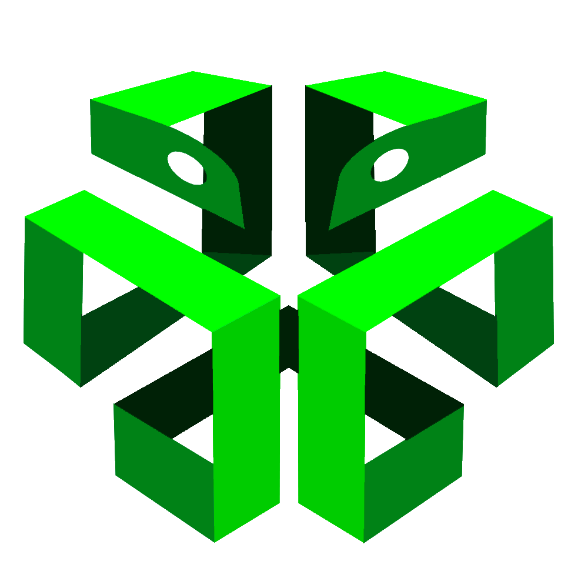

# PyBox



#### PyBox provides you with a compilation of many such Python games, serving as a platform to, simply put, have fun. Ranging from pen and paper games like Tic Tac Toe to watered down and modified versions of popular classic arcade games like Snake, Flappy bird and Pong, we have a game for everybody to play.
#### PyBox was created with a simple aim. To chase away boredom using simple games designed in Python. Here you can find some of your favorite games to play in your pastime.
<br>

## Games
* ### [Flappy Ball](https://hhhrrrttt222111.github.io/Python-Games/python/Flappy.html) 
* ### [Tile 15](https://hhhrrrttt222111.github.io/Python-Games/python/Tile-15.html)
* ### [Tic-Tac-Toe](https://hhhrrrttt222111.github.io/Python-Games/python/Tic-Tac-Toe.html)
* ### [Canon Fire](https://hhhrrrttt222111.github.io/Python-Games/python/Cannon-Fire.html)
* ### [Connect 4](https://hhhrrrttt222111.github.io/Python-Games/python/Connect-Four.html)
* ### [Snake](https://hhhrrrttt222111.github.io/Python-Games/python/Snake.html)
* ### [Maze](https://hhhrrrttt222111.github.io/Python-Games/python/Maze.html)
* ### [Tetris](https://hhhrrrttt222111.github.io/Python-Games/python/Tetris.html)
* ### [Guessing Number](https://hhhrrrttt222111.github.io/Python-Games/python/Guessing-Number.html)
* ### [Pacman](https://hhhrrrttt222111.github.io/Python-Games/python/Pacman.html)
* ### [Hangman](https://hhhrrrttt222111.github.io/Python-Games/python/Hangman.html)
* ### [Egg Catcher](https://hhhrrrttt222111.github.io/Python-Games/python/Egg-Catcher.html)
* ### [Tron](https://hhhrrrttt222111.github.io/Python-Games/python/Tron.html)
* ### [Pong](https://hhhrrrttt222111.github.io/Python-Games/python/Pong.html)
* ### [Catch The Ball](https://hhhrrrttt222111.github.io/Python-Games/python/Catch-The-Ball.html)
* ### [Matchmaker](https://hhhrrrttt222111.github.io/Python-Games/python/Matchmaker.html)

<br><br>


### Download Python :snake:
* https://www.python.org/downloads/

### Download Pycharm :computer:
* https://www.jetbrains.com/pycharm/download/#section=windows

## Get Started
```
pip install pygame
pip install freegames

```
```
import turtle as tk
import tkinter as t
import freegames
import pygame
```

<br><br>

### References
* https://www.freecodecamp.org/
* http://www.grantjenks.com/blog/


